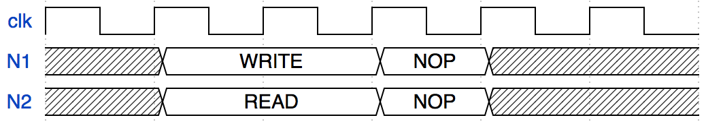

# TIS-100
An attempt to re-create the [TIS-100 Tessellated Intelligence System](http://www.zachtronics.com/tis-100/) (as faithfully as possible) in VHDL

The end goal is to create a template for [PYNQ](https://github.com/Xilinx/PYNQ) [Overlays](http://pynq.readthedocs.io/en/v2.1/pynq_overlays.html) that can execute programs that would work in the game and reach the same results.

This requires four main things:

1. VHDL models of the different T** nodes described in the TIS-100 Manual and the overall system (clock distribution, memory buses, etc.)
2. Some sort of Architecture Description Language (ADL) to make it easy to compose them into clusters that resemble the ones in the game
3. An "assembler" that takes the language accepted by the game and transforms it into actual instructions, ready to transfer to the FPGA
4. An Overlay package that wraps all this up nicely and allows users to run their own code on their very own, real-world TIS-100

## About this Document

This document is very much a slice of my thought process in attempting this project.
It is not meant to be a clear cut reference or spec - another document will do that.

Rather, if you read this from top to bottom you'll go through the same rollercoaster of ideas, setbacks and epiphanies as I did thinking this up - with some slight editing, I'll admit.

So, enjoy the ride!

## System Design

The overall system parameters define the framework for the individual nodes' functionality and inform things like the width and design of data connections and internal buses.

We'll go through a few aspects of that system design, using the **T21 Basic Execution Node** as a reference.
All other available nodes (with the exception of the Visualization Module) are much simpler and can be thought of as variations of this one.

### Clock
All the nodes in a TIS-100 follow the same clock. For easy debugging, its speed is adjustable, from *stopped* to, uh... *fast*.
Nothing to worry about here - maybe we can use SW1 and SW0 on the PYNQ board to select a speed, and one of the push buttons to step (we should probably also enable stepping via the Overlay driver, so we can do it from Python).

### Arithmetic Range
Next, let's see how many bits we need!

All data on the TIS-100 is numeric in nature.
To be precise, every peace of data is an integer in the interval [-999, 999].
That's 1998 numbers in total, so the nearest power of 2 is 2^11 = 2048.
That means we need to use 11 bits to represent our numbers, since you can represent 2^n numbers using n bits.

Conveniently, that leaves 50 numbers we cannot use for math, which comes in useful when designing the ISA.
Let's do what all the cool kids do and use [two's complement](https://en.wikipedia.org/wiki/Two%27s_complement) for negative numbers.

> **Architecture Note:**
>
> The TIS-100 VHDL System will use 11-bit signed (two's complement) integer numbers

With that decided, let's look at the minimum and maximum numbers our system can use in 11-bit binary:

```
 999: 01111100111
-999: 10000011001
```

> **Architecture Note:**
>
> The addition and subtraction operations do not overflow, but saturate at the interval limits.
> We'll need to keep this in mind when designing the ALU!

Due to the way two's complement numbers work, this means we can nab the block in between those two for our own sordid purposes.
Since there aren't that many special values, I'll just take the block from `10000000000` to `10000001111` - easy to recognize, and 16 "special" numbers are more than we need!

> **Architecture Note:**
>
> Registers and ports are numbered starting from `10000000000` when expressed as 11-bit numbers.

*Another note:*

*One could also choose to use Binary Coded Decimal (BCD) arithmetic for the TIS-100.
Signed BCD would only use one more bit than two's complement (4 bits for each decimal place, plus one sign bit) and we could still squeeze in the registers in the space BCD doesn't use.*

*But ultimately, it doesn't make much of a difference, I hope, and two's complement is more familiar (and maybe, better supported by synthesis tools?)*

### Registers & Ports
Now, what special numbers might we need?
The first thing that comes to mind are the ACC and NIL registers of the T21 node.
They can be used in the place of literal numbers with any instruction, so we need a way to encode them.
(NIL is special, but for now, let's treat it like a register)

There's also the four Ports (plus two "Pseudo-Ports") that every T21 node has:

* UP
* DOWN
* LEFT
* RIGHT

* ANY
* LAST

That gets us up to 8 registers (and register-y things) total.
Yay!
We have half of our special numbers left!

Anyhow...
Each port is a synchronous (with some exceptions, depending on the node), bidirectional (again, with exceptions) data connection between two end points.
So of course, each one needs 11 data wires (one for each bit, duh).

But what else?

To get a definitive answer, we also need to consider the "Pseudo-Ports", LAST and ANY.

ANY writes to whatever port first indicates it wants to read, or reads from whichever port receives data first.
LAST works together with ANY, but is pretty easy:
It just means "the last thing ANY picked", so we need to save that in a special, hidden 2-bit (there's only four options) register.
(The manual specifies that the behavior of LAST with no preceding ANY is undefined, so this is fine. But the reference implementation stalls when using LAST without ANY, so we may want to use another bit to show whether LAST has been initialized)

Without spending too much time on premature optimization, let's add two extra wires to the Port interconnect: WRITE and READ.

> **Architecture Note:**
>
> The physical interface at a Port consists of 11 DATA wires, one READ and one WRITE wire.

With those, ANY can just choose the port whose WRITE or READ wire is being pulled high by a neighbor.
A quick experiment shows that in case of multiple ports receiving data in the same cycle, the order of precedence is

**LEFT, RIGHT, UP, DOWN**

for reading, and

**UP, LEFT, RIGHT, DOWN**

for writing.

Also, it turns out that when an ANY write only has ANY reads to pick from

Whoa there.

If you stop and think about it, that means that a T21 node that's sending data to ANY must put it on all 4 of the data buses, but only one neighbor may read it.
Since the read cannot wait another cycle for handshaking (that would cause the nodes to go out of sync compared to the game), we'll have to do some thinking.

The worst possible case is a `MOV ACC, ANY` instruction at a node N1, followed, a few cycles later (let's say 2), by multiple `ADD ANY` instructions in neighboring nodes N2 and N3.
In the game, one of those ADDs would finish within one step.

But if we break down what happens in that step, we see that it's impossible to realize that within just one *clock cycle*:

1. N2 and N3 indicate that they want to read something.
   N1 has already indicated it wants to send something, and they both know this.
   But crucially, they cannot actually grab the data and continue before clearing up who gets to have it.
   Remember, only one node can receive an ANY packet.
2. N1 must decide which of its neighbors gets the data - it's the only node that *can* decide that, because its neighbors don't have a direct connection.
   N1 must then communicate its decision by pulling low all the WRITE wires for all neighbors that *didn't* get picked.

   Since N2 and N3 are *reading from* ANY, the same thing happens on their other neighbors in parallel.
3. Finally, each neighbor checks which of its WRITE wires is high, and picks that port, then reads the data from that port and continues.

   It needs to communicate which one it picked back to N1, so N1 can change its WRITE wires again to give the data to another neighbor if needed.
   This could go back and forth for a while...

   There's a whole addition (including saturation) left to do!
   Even worse, the instruction could also be a `JRO ANY`, which is an addition that saturates to a dynamic bound.
   But let's let the ALU worry about that.

That's a lot of communication for a single clock cycle.
Too much, in fact.

In case you're not familiar with hardware design, parts usually only check their inputs at the time of the rising edge, and any data they output can only safely be assumed to be visible to anyone (including themselves) at the next rising edge.

This behavior is called **clock synchronous**.

Looking at the steps above, we see that there's at least two groups of messages that need to be exchanged between N1 and its neighbors (and that isn't even taking into account adjusting the allocation if one of N1's neighbors gets a better offer!):


That's three cycles in total (one for each message, and one for the add) - two more than we actually have - and again, that's the easiest possible case for an ANY write with multiple possible targets.

So now what?

Well, we cheat.
First off, since the clock speed was never going to be very high anyway, we can work at double the clock speed internally by not only updating on the rising clock edge, but the falling one too.

That still leaves us one cycle short though.
This means we have to cheat even more and use **asynchronous** behavior for setting the READ and WRITE wires.
That way, we can let analog circuits do the back and forth negotiation of who gets what data.

Asynchronous behavior is kind of tricky to program in VHDL (or in general, really).
Put very simply, with synchronous behavior, you only have to be convinced that your logic is valid at one particular moment in time: The clock edge.
You can reasonably assume that all relevant inputs will have sane values at that time.

No such comforts  with asynchronous behavior.
You need to keep in mind all possible combinations of inputs, and whether they're going to cause a critical error.
But in this case, we're in luck - the precedence function for who gets to read can be expressed without too much fuss:

```
TOP_WRITE = TOP_READ
LEFT_WRITE = NOT(TOP_READ) AND LEFT_READ
RIGHT_WRITE = NOT(TOP_READ) AND NOT(LEFT_READ) AND RIGHT_READ
BOTTOM_WRITE = NOT(TOP_READ) AND NOT(LEFT_READ) AND NOT(RIGHT_READ) AND BOTTOM_READ
```

The equations for the READ wires are similar.
If we implement this (correctly), then the example from earlier might look something like this on the wires:


READ3 and WRITE3 show our asynchronous logic in action:
WRITE2 and WRITE3 start off high, because N1 is writing to ANY.
Then WRITE3 is pulled low, because READ2 is high and takes precedence over READ3.
This in turn causes READ3 to go down with it - N3 is not allowed to read, so it indicates that it won't.

But as soon as READ2 goes low again, both WRITE3 and READ3 go back up.
Any synchronous logic would only have "seen" the high values of READ2 and READ3 much later and have cost us another cycle!

\*Record scratch sound\*

Well, that was a fun little excursion, but it turns out asynchronous logic actually isn't the solution here.

Even if I took the time to figure out everything, then asynchronous logic would still be sensitive to minute time differences.
That is, the first node to pull a READ wire high would get the WRITE, not the one that *should* get it according to the precedence list.

So, we'll have to abandon the notion that one "step" in the game corresponds to one cycle in our hardware implementation.
Too bad :(

Instead, we will have to model all the communication explicitly, using rules that generate the behavior we want using just the local knowledge a node has.

I programmed a simulation in Clojure to test some of those rules (turns out this is essentially a cellular automaton, but that's not important here).
Here's the set of rules I came up with:

1. At the start of each step, all nodes initialize a boolean variable that tells them if it's their "turn" to update.
This is TRUE initially for reading nodes, and FALSE for writing ones.
2. All nodes that want to either read from or write to ANY (depending on whether it's been an even or odd number of cycles since the start) follow this rule:

    * If any neighbors have their wires high, check the precedence function and confirm the highest priority one by pulling our wire high.
    * If no neighbors have their wires high, pull *all* of ours high.
3. This goes on until two succeeding steps have made no changes to the configuration of the READ and WRITE wires, **globally*.

That third step poses a problem.
I just mentioned that we want to only use node local knowledge.
Well, we can't, in this case.
So we'll add another wire and call it "PORTS_SETTLED".
It will rest at 0, but any node can pull it to 1.
Now all the nodes can check its value and know that the port negotiation phase is done when it's finally 0.
Nodes that do not use ports or read to/write from a fixed one can simply leave it alone, and the ANY nodes pull it high until they have observed the same values on their READ/WRITE wires for three cycles (three because reading and writing nodes take turns updating).

To isolate all of this asynchronous mess from the main CPU, we'll put it in a dedicated Port Management Unit (PMU). More on that further down this file!

Port read and write operations also act as synchronization points;
Execution will not continue until they're complete!
Let's assume that we're able to do a read from or write to a port in one cycle - the manual says timing and performance may vary between hardware, but we'll stick to the reference implementation for the sake of simplicity.

Let's look at some examples of that!
I've simplified the instruction set to READ, WRITE and NOP to make these simpler, so imagine that N1 and N2 are connected by exactly one Port.

First up is the simplest case of "READ and WRITE happen at the same time":



Huh? Why does this take two cycles?
That would be because of the synchronous nature of a CPU - without cheating (and we've decided to confine the cheating to the PMU), we can only see the state of the world at the exact moment of the rising clock edge.

So that is when N1 and N2 need to decide whether their operations are finished.
But they can't see yet that the other wants to read/write, respectively.
That information will only become available with the next rising clock edge.
When that information does arrive, it's already too late to decide on another instruction, so we're stuck in READ/WRITE for the another cycle.

*... Or at least that would be a sensible explanation. But:*

What if N1 starts writing before N2 starts reading?
In the game, what happens looks a lot like this:


Upon first glance, this seems reasonable:
The READ is only one cycle because N1's write has already had time to propagate to N2.

But how does N1 know to stop this fast?!
The information that N2 is reading should only become known to N1 at the next rising clock edge!

So it turns out that TIS-100 is doing some cheating of its own.
We'll need those falling-edge "half-cycles" outside of the PMU after all!

At least if we delay the other way around (i.e. WRITE after READ), we get the expected result:


Just like the first case, except that they finish one cycle later because the WRITE happens later.
Phew.

One last note:

Given that Port transfers wait for the other side to acknowledge (by pulling either READ or WRITE high), the process will deadlock whenever both sides of a Port try to read or write at the same time.
The manual says that "a hardware fault will occur", but no such thing happens in the reference implementation.
The two nodes will simply wait forever.

Especially with that potential to deadlock, a RESET pin is crucial for the VHDL implementation!

> **Architecture Note:**
>
> Each Node has a high-active RESET pin in addition to its CLOCK input and any Ports.

## ISA

Unlike all the other nodes featured in the game, the T21 node is programmable.
Luckily for us, the instruction set is very simple:
There's only 13 instructions (we'll get to what they are later).

That means we need 4 bits in our instruction word to encode the opcode.
Let's see how much we need for the operands!

Let's break it down into categories:

### Moving Data

* **NOP**

  A bit of a cheat, I know. But I guess this moves no data to nowhere.
  Easy!
* **MOV** src: {literal, port, ACC, NIL}, dst: {register, port, ACC, NIL}

  A bit more interesting!
  We figured out earlier that our literals are 11 bits long, and that with those 11 bits, we can also encode the registers and ports.
  But what about *dst*? Since we only have 8 special targets, we can get away with only using 3 bits for that!

  When moving to ACC or NIL, this takes one cycle.
  Writes to a Port block until the other side moves out of that port.
  **Note:** A Port write will block for at least one cycle, even if another node is already waiting on the other side - you need to write to the Port *before* the other side can read!

  *Reads* from a Port will block until data is available, but without the one cycle minimum that writes incur.
* **SWP**

  This swaps ACC with the special register BAK - no operands, no problem!
* **SAV**

  This *copies* ACC into BAK - again, no operands!


### Arithmetic

* **ADD** src: {literal, port, ACC, NIL}

  Add the operand to ACC.
  Again, when reading from a Port, this may block.
  ACC saturates at 999 (or -999 if adding a negative number, which is possible).

* **SUB** src: {literal, port, ACC, NIL}

  Subtract the operand from ACC (will block if reading from a Port).
  ACC saturates at -999 (or 999 if subtracting a negative number, as above).

* **NEG**

  Negate the value in ACC (0 remains 0)


### Jumps

Jumps are going to be interesting, for two reasons that are intertwined:

1. It's not possible to jump out of the program
2. The length of the program has an upper bound, but can vary

This means relative jumps (see **JRO** below) in particular need to be somewhat supervised.

> **Architecture Note:**
>
> We need a way to figure out the length of the currently loaded program at run time.
> See "Extra Instructions" below for ideas on how to do this.
> We'll call that value *programLength*.

Given the length of the program, we can now ensure that the PC is never less than 0 or more than *programLength*.

* **JMP** target: literal
  Jump to the specified address in the program, i.e. set the Program Counter (PC) to *target*.

* **JEZ** target: literal
  Jump to *target* if ACC is zero.

* **JNZ** target: literal
  Jump to *target* if ACC is *not* zero.

* **JGZ** target: literal
  Jump to *target* if ACC is strictly greater than zero.

* **JLZ** target: literal
  Jump to *target* if ACC is strictly less than zero.

* **JRO** offset: literal
  Jump to PC + *offset*.
  If *offset* is zero, this will trap the machine in an infinite loop!

  Note that this, too, is bounded at *programLength* and does **not** wrap, which means the program

  ```
  MOV 1 ACC
  JRO ACC
  ```

  Is an infinite loop!

  ACC is 1, the JRO instruction tries to jump ahead by 1, but since there is no instruction after JRO to jump to, it gets "stuck".


### Extra Instructions

This section is primarily dedicated to figuring out how to find the length of the current program.

Two alternatives come to mind:

* **LEN** programLength: literal

  Must be the first instruction in any T21 program.
  This tells the CPU how long the program is and thereby sets the upper bound for jumps.
  Easier from a hardware perspective (read *programLength* into a register, then use it from there), but there's a few downsides:
    1. The assembler now needs to count instructions, making it more complex
    2. All programs are one instruction longer than their "original" TIS-100 equivalent.
    3. How do we count the space the LEN instruction is at?
       For programs to work as quickly as on a "real" T21, it would need to be "-1" and only
       executed once after a reset.

* **VOID**
  Denotes unused program space.
  Since the T21 has only 15 instructions' worth of program memory, it's feasible to detect how many of those are used by using a specialized memory matrix.

  This is spectacularly wasteful in terms of hardware used vs. using a BRAM on an FPGA, but it avoids the issues with LEN above.

  A VOID instruction must never be executed. If it is, the T21 will halt.
  So, just as it would be the assembler's responsibility to calculate the correct length if we used the LEN instruction above, with VOID it would be the assembler's responsibility to ensure the program is contiguous in memory.

  Then again, that's what it would have to do anyway.
  No point in allowing the assembler to mix in illegal instructions, is there?


### Instruction format

For those not keeping track in their head:
The longest instruction we have is MOV, with its two parameters - one literal/register/port (11 bits), one register/port (3 bits).

So how many bits do we need in total?
Behold!
```
    4 bits for the opcode
   /
  /    11 bits for the first operand (if any)
 /    /           3 bits for the second operand (if any)
/    /           /
0000 00000000000 000

18 bits total
```

### Loading a program

The next question is:

How do we even load a program into a T21 node?
Let's go with a pretty easy way:

> **Architecture Note:**
>
> Each T21 node has an 18-bit wide DATA port and DEN (data enable) pin.
> If DEN is high, the values from DATA are written to program memory on rising clock edge.
>
> An internal counter increments after every clock cycle, and is reset when RESET is pulled high.

This approach allows us to connect the DEN pins of all nodes to a multiplexer and their DATA ports to a single bus.

The interface to the outside world might then be shared memory, with some logic to deal with the resetting, read from the shared memory block and manage the node address (i.e. the input to the DEN mux), incrementing it after reading a VOID instruction or something.

**OH HEY!**

Having a special register that gets incremented every time we add an instruction to the program sure sounds a lot like it might solve our *programLength* problem!

And without any extra hardware effort, to boot!

## T21 Internals

Having figured out a rough architecture, let's get more specific:

What components does a T21 node have, and how do they work?

Starting with the obvious, we have at least two parts:

* The **Control Unit (CU)**
  This manages the Program Counter, fetches and decodes instructions and takes care of jumps
  (with the exception of relative jumps, which need the EU / ALU to compute the jump target).
  It also sets the EU's inputs to the correct values.
* The **Execution Unit (EU)**
  This does the actualy computation (so, addition and subtraction, in our case).

You might have noticed the frankly careless use of "*the correct values*" up there.
But seeing as we have Ports to deal with, that won't always be as easy as we'd like.
So let's add another unit to the mix:

* The **Port Management Unit (PMU)**

  This can be fed a port address (including the two Pseudo-Ports), a READ/WRITE bit and - in case we're writing - some data (DIN).
  There's also an ENABLE and a RDY wire - but since we decided above that the PMU was going to be *asynchronous*, there's **no** CLOCK input!

  It will do what we tell it to and pull its RDY wire high when it's done.
  Of course, it will also provide whatever data it has read on DOUT.

  The rest of the T12 node should stall until the PMU has done its work.


